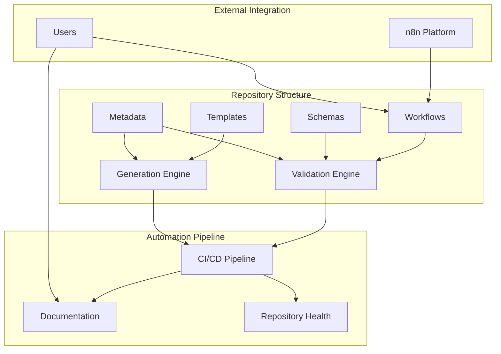

# Component Architecture Overview

> **System components, interactions, and architectural patterns**

## System Architecture



## Core Components

### 1. Validation System

**Purpose**: Ensure workflow quality, consistency, and compliance

**Components**:
- **WorkflowValidator Class** - Main validation orchestrator
- **AJV Schema Engine** - JSON schema validation
- **File Structure Checker** - Required files validation
- **README Analyzer** - Documentation completeness
- **Consistency Checker** - Cross-workflow validation

**Data Flow**:
```
Workflow Files → Structure Check → JSON Parsing → Schema Validation → Documentation Check → Results
```

**Key Files**:
- `/scripts/validate-workflow.js` - 273 lines, validation engine
- `/schemas/metadata.schema.json` - 320 lines, validation rules
- `/schemas/workflow.schema.json` - n8n format validation

### 2. Documentation System

**Purpose**: Automated documentation generation and maintenance

**Components**:
- **ReadmeGenerator Class** - Template-based documentation generator
- **Metadata Extractor** - Workflow information extraction
- **Template Engine** - Structured documentation creation
- **Cross-Reference Manager** - Link validation and updates

**Generation Process**:
```
Metadata + Workflow JSON + Template → Content Processing → README Generation → Validation
```

**Key Files**:
- `/scripts/generate-readme.js` - 181 lines, generation engine
- `/templates/workflow-readme.md` - 269 lines, documentation template
- Generated READMEs - ~270 lines each, technical specifications

### 3. Schema Management

**Purpose**: Define and enforce data structure standards

**Schema Types**:
- **Metadata Schema** - 35+ fields, workflow characteristics
- **Workflow Schema** - n8n platform compatibility
- **Documentation Schema** - README structure requirements

**Validation Hierarchy**:
```
JSON Schema (Draft 07) → AJV Validation → Custom Rules → Error Reporting
```

**Schema Features**:
- **Required Fields** - Core workflow identification
- **Enumerated Values** - Controlled vocabularies
- **Format Validation** - Dates, versions, patterns
- **Complex Validation** - Nested objects, arrays, relationships

### 4. CI/CD Pipeline

**Purpose**: Automated quality assurance and deployment

**GitHub Actions Workflows**:
- **validate-workflows.yml** - Automated validation on PR/push
- **generate-docs.yml** - Documentation updates and synchronization

**Pipeline Stages**:
```
Code Push → Validation Checks → Documentation Generation → Quality Gates → Deployment
```

**Quality Gates**:
- ✅ All workflows validate successfully
- ✅ No schema compliance errors
- ✅ Documentation completeness verified
- ✅ No security issues detected (secrets scan)
- ✅ Consistency checks pass

## Component Interactions

### Validation → Documentation Pipeline

```javascript
// Validation ensures quality before documentation generation
validateWorkflowFolder(path) → generateFromWorkflow(path) → writeReadme(path)
```

**Dependencies**:
- Documentation generation requires valid metadata
- README completeness checked by validation
- Template updates propagate through regeneration

### Schema → Validation Integration

```javascript
// Schema definitions drive validation rules
loadSchema(path) → configureAJV() → validateMetadata() → reportErrors()
```

**Schema Evolution**:
- Schema changes require validation updates
- Backward compatibility maintained through versioning
- Migration scripts handle schema transitions

### CI/CD → Quality Assurance

```yaml
# Automated quality pipeline
validate-workflows → check-consistency → generate-docs → security-scan → deploy
```

**Feedback Loops**:
- Validation failures block merges
- Documentation updates trigger re-validation  
- Schema changes require full pipeline execution

## Design Patterns

### 1. Template Pattern

**Usage**: README generation from metadata
```javascript
template.replace(/{Workflow Name}/g, metadata.name)
```

**Benefits**:
- Consistent documentation structure
- Easy template updates across all workflows
- Separation of content from presentation

### 2. Strategy Pattern

**Usage**: Different validation strategies per component
```javascript
validateWorkflowJSON(workflow) // n8n format validation
validateMetadataSchema(metadata) // Schema compliance
validateDocumentation(readme) // Completeness check
```

**Benefits**:
- Modular validation components
- Easy addition of new validation rules
- Independent error reporting per strategy

### 3. Observer Pattern

**Usage**: CI/CD pipeline reactions to repository changes
```yaml
on: [push, pull_request] → trigger validation → report status → update badges
```

**Benefits**:
- Automated quality assurance
- Real-time feedback on changes
- Status visibility through badges and reports

## Data Architecture

### Metadata Model

```json
{
  "core": {
    "name": "string",
    "description": "string", 
    "version": "semver",
    "category": "enum"
  },
  "operational": {
    "triggers": ["enum"],
    "complexity": "enum",
    "execution_time": "pattern",
    "resources": { "memory": "enum", "cpu": "enum" }
  },
  "maintenance": {
    "frequency": "enum",
    "support_contact": "string",
    "last_reviewed": "date"
  },
  "security": {
    "data_sensitivity": "enum",
    "compliance_requirements": ["enum"]
  }
}
```

### Workflow Structure

```json
{
  "nodes": [
    {
      "id": "string",
      "name": "string", 
      "type": "string",
      "position": [x, y],
      "parameters": {}
    }
  ],
  "connections": {
    "node_id": {
      "main": [
        [{"node": "target_id", "type": "main", "index": 0}]
      ]
    }
  }
}
```

## Performance Characteristics

### Validation Performance
- **Single Workflow**: <100ms average
- **All Workflows** (3): <500ms total
- **Schema Loading**: One-time cost ~50ms
- **Memory Usage**: ~15MB base, +1-2MB per workflow

### Documentation Generation
- **Single README**: <200ms generation time
- **Template Processing**: <50ms per workflow
- **File I/O**: Dominant performance factor
- **Batch Processing**: Linear scaling with workflow count

### CI/CD Pipeline
- **Validation Stage**: ~30s full repository check
- **Documentation Stage**: ~15s regeneration
- **Security Scan**: ~45s comprehensive scan
- **Total Pipeline**: ~2min average execution

## Security Architecture

### Threat Model

**Assets**:
- Workflow configurations and business logic
- Metadata containing system information  
- Documentation revealing internal processes
- CI/CD pipeline credentials and secrets

**Threats**:
- Credential exposure in workflow files
- Sensitive data leakage through metadata
- Unauthorized workflow modifications
- CI/CD pipeline compromise

### Security Controls

**Prevention**:
- `.gitignore` excludes sensitive files
- Schema validation prevents credential inclusion
- PR templates enforce security review checklist
- Automated secret scanning in CI/CD

**Detection**:
- Validation scripts check for hardcoded secrets
- CI/CD pipeline security scanning
- Dependency vulnerability monitoring
- Access logging and audit trails

**Response**:
- Automated blocking of insecure changes
- Alert notifications for security issues
- Rollback capabilities for problematic changes
- Incident response procedures

## Scalability Considerations

### Horizontal Scaling

**Workflow Growth**:
- Linear validation time scaling with workflow count
- Template-based documentation generation scales efficiently
- Category-based organization supports growth
- Parallel processing opportunities in CI/CD

**Schema Evolution**:
- Backward compatibility through versioning
- Migration scripts for breaking changes
- Optional field additions don't break existing workflows
- Deprecation strategies for old features

### Vertical Scaling

**Complexity Growth**:
- Schema validation handles complex nested structures
- Documentation templates support detailed specifications
- Error reporting scales with validation rule count
- Performance optimization opportunities available

## Integration Points

### n8n Platform Integration

**Import/Export**:
- Workflows exported from n8n as JSON
- Direct import compatibility maintained
- Version compatibility tracking in metadata
- Node type requirements documentation

**Execution Environment**:
- Credential management through n8n
- Environment variable configuration external
- Runtime dependencies specified in metadata
- Performance characteristics documented

### External Systems

**CI/CD Platforms**:
- GitHub Actions for primary automation
- Extensible to other CI/CD systems
- Status reporting through standard APIs
- Badge integration for visibility

**Documentation Systems**:
- Markdown format for broad compatibility
- GitHub rendering optimization
- Export capabilities for external systems
- API documentation generation potential

---

*Component architecture overview generated on: 2024-09-01*  
*Architecture reflects current system state and design decisions*